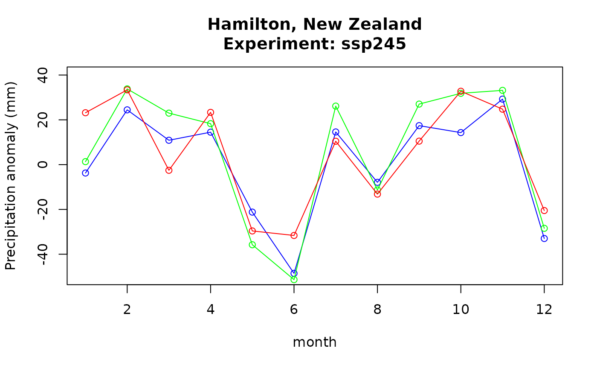

# Processing climate projection data

Climate projection data sets are produced in a variety of formats but
all conform to the CF Metadata Conventions. NetCDF data files, in
particular, are highly structured and relatively easy to process. That
said, it is very important to maintain a proper processing workflow such
that the small changes in the climate projections are maintained and
revealed through analysis. In this document, the basic workflow with
varying calendars is described.

> In this vignette we are using the [`ncdfCF`
> package](https://cran.r-project.org/package=ncdfCF) as that provides
> the easiest interface to work with netCDF files. Package `CFtime` is
> integrated into `ncdfCF` which makes working with time dimensions in
> netCDF seamless.  
> Packages `RNetCDF` and `ncdf4` can work with `CFtime` as well but then
> the “intelligence” built into `ncdfCF` is not available, such as
> automatically identifying axes and data orientation. Other packages
> like `terra` and `stars` are not recommended because they do not
> provide access to the specifics of the time dimension of the data and
> do not consider any calendars other than “proleptic_gregorian”.

## Processing climate projection data

Individual files containing climate projections contain global, regional
or local data, typically on a rectangular latitude-longitude grid, for a
single parameter such as “near-surface temperature”, and for a number of
time steps. An analysis workflow then consists of a number of steps:

- Download the appropriate data files for your desired combination of
  model, experiment, realization, geography, time range, parameter, …
  (called a “data suite” henceforth). If your analysis involves multiple
  parameters (such as temperature and precipitation to estimate crop
  productivity), repeat the process for all parameters. If you want to
  make a multi-model ensemble to reduce model bias, repeat again for all
  desired model, experiment and realization combinations (“ensemble
  member”). You end up having one or more data suites to work with.
- Take all files in a data suite and extract the data. Process the data
  in the data suite. Since the data are (mostly) 3-dimensional arrays,
  this will involve binding the arrays on the right dimension and then
  do something like `apply(data, 1:2, tapply, f, fun)` (following the CF
  Metadata Conventions, dimensions 1 and 2 are “longitude” and
  “latitude”, respectively; the third dimension is “time”; none of this
  is standardized though and deviations are out there; package `ncdfCF`
  can help with the `CFVariable$array()` method). Repeat for the data
  suite for each ensemble member.
- Combine the above results as your workflow requires. Frequently this
  involves computing “anomalies”: ratio the data for one or more future
  periods to a baseline period. Repeat for each ensemble member.
- Construct the multi-model ensemble from the individual ensemble
  members.

Apart from the first step of obtaining the data, the steps lend
themselves well to automation. The catch, however, is in the factor `f`
to use with [`tapply()`](https://rdrr.io/r/base/tapply.html). The
different models (in your ensemble) use different calendars, meaning
that different factors are required. The `CFtime` package can help out.

The `CFTime$factor()` method produces a factor that respects the
calendar of the data files. The method comes in two operating modes:

- Plain vanilla mode produces a factor for a time period across the
  entire time series. The factor level includes the year. This would be
  useful to calculate mean temperature for every month in every year,
  for instance.
- When one or more “eras” (periods of interest) are provided, the factor
  level no longer includes the year and can be used to calculate, for
  instance, the mean temperature per period of interest in the era
  (e.g. average March temperature in the era 2041-2060).

``` r
# Setting up
library(ncdfCF)
fn <- list.files(path = system.file("extdata", package = "CFtime"), full.names = TRUE)[1]
(ds <- ncdfCF::open_ncdf(fn))
#> <Dataset> pr_day_GFDL-ESM4_ssp245_r1i1p1f1_gr1_20150101-20991231_v20180701 
#> Resource   : /home/runner/work/_temp/Library/CFtime/extdata/pr_day_GFDL-ESM4_ssp245_r1i1p1f1_gr1_20150101-20991231_v20180701.nc 
#> Format     : netcdf4 
#> Collection : CMIP6 
#> Conventions: CF-1.7 CMIP-6.0 UGRID-1.0 
#> Has groups : FALSE 
#> 
#> Variable:
#>  name long_name     units      data_type axes          
#>  pr   Precipitation kg m-2 s-1 NC_FLOAT  lon, lat, time
#> 
#> External variable: areacella
#> 
#> Attributes:
#>  name                  type      length
#>  external_variables    NC_CHAR     9   
#>  history               NC_CHAR   124   
#>  table_id              NC_CHAR     3   
#>  activity_id           NC_CHAR    11   
#>  branch_method         NC_CHAR     8   
#>  branch_time_in_child  NC_DOUBLE   1   
#>  branch_time_in_parent NC_DOUBLE   1   
#>  comment               NC_CHAR    10   
#>  contact               NC_CHAR    32   
#>  Conventions           NC_CHAR    25   
#>  creation_date         NC_CHAR    20   
#>  data_specs_version    NC_CHAR     8   
#>  experiment            NC_CHAR    30   
#>  experiment_id         NC_CHAR     6   
#>  forcing_index         NC_INT      1   
#>  frequency             NC_CHAR     3   
#>  further_info_url      NC_CHAR    77   
#>  grid                  NC_CHAR    94   
#>  grid_label            NC_CHAR     3   
#>  initialization_index  NC_INT      1   
#>  institution           NC_CHAR   112   
#>  institution_id        NC_CHAR     9   
#>  license               NC_CHAR   805   
#>  mip_era               NC_CHAR     5   
#>  nominal_resolution    NC_CHAR     6   
#>  parent_activity_id    NC_CHAR     4   
#>  parent_experiment_id  NC_CHAR    10   
#>  parent_mip_era        NC_CHAR     5   
#>  parent_source_id      NC_CHAR     9   
#>  parent_time_units     NC_CHAR    19   
#>  parent_variant_label  NC_CHAR     8   
#>  physics_index         NC_INT      1   
#>  product               NC_CHAR    12   
#>  realization_index     NC_INT      1   
#>  realm                 NC_CHAR     5   
#>  source                NC_CHAR   560   
#>  source_id             NC_CHAR     9   
#>  source_type           NC_CHAR    18   
#>  sub_experiment        NC_CHAR     4   
#>  sub_experiment_id     NC_CHAR     4   
#>  title                 NC_CHAR    82   
#>  tracking_id           NC_CHAR    49   
#>  variable_id           NC_CHAR     2   
#>  variant_info          NC_CHAR     3   
#>  references            NC_CHAR    30   
#>  variant_label         NC_CHAR     8   
#>  value                                              
#>  areacella                                          
#>  File was processed by fremetar (GFDL analog of ... 
#>  day                                                
#>  ScenarioMIP                                        
#>  standard                                           
#>  60225                                              
#>  60225                                              
#>  <null ref>                                         
#>  gfdl.climate.model.info@noaa.gov                   
#>  CF-1.7 CMIP-6.0 UGRID-1.0                          
#>  2019-06-18T05:29:00Z                               
#>  01.00.27                                           
#>  update of RCP4.5 based on SSP2                     
#>  ssp245                                             
#>  1                                                  
#>  day                                                
#>  https://furtherinfo.es-doc.org/CMIP6.NOAA-GFDL.... 
#>  atmos data regridded from Cubed-sphere (c96) to... 
#>  gr1                                                
#>  1                                                  
#>  National Oceanic and Atmospheric Administration... 
#>  NOAA-GFDL                                          
#>  CMIP6 model data produced by NOAA-GFDL is licen... 
#>  CMIP6                                              
#>  100 km                                             
#>  CMIP                                               
#>  historical                                         
#>  CMIP6                                              
#>  GFDL-ESM4                                          
#>  days since 1850-1-1                                
#>  r1i1p1f1                                           
#>  1                                                  
#>  model-output                                       
#>  1                                                  
#>  atmos                                              
#>  GFDL-ESM4 (2018):\natmos: GFDL-AM4.1 (Cubed-sphe...
#>  GFDL-ESM4                                          
#>  AOGCM AER CHEM BGC                                 
#>  none                                               
#>  none                                               
#>  NOAA GFDL GFDL-ESM4 model output prepared for C... 
#>  hdl:21.14100/48767401-8960-4864-8738-e64640bef71d  
#>  pr                                                 
#>  N/A                                                
#>  see further_info_url attribute                     
#>  r1i1p1f1

# The T axis, with name "time" has a CFTime instance
t <- ds[["time"]]$time

# Create monthly factors for a baseline era and early, mid and late 21st century eras
baseline <- t$factor(era = 1991:2020)
future <- t$factor(era = list(early = 2021:2040, mid = 2041:2060, late = 2061:2080))
str(baseline)
#>  Factor w/ 12 levels "01","02","03",..: 1 1 1 1 1 1 1 1 1 1 ...
#>  - attr(*, "era")= int 30
#>  - attr(*, "period")= chr "month"
#>  - attr(*, "CFTime")=CFClimatology with origin [days since 1850-01-01] using calendar [noleap] having 12 offset values
str(future)
#> List of 3
#>  $ early: Factor w/ 12 levels "01","02","03",..: NA NA NA NA NA NA NA NA NA NA ...
#>   ..- attr(*, "era")= int 20
#>   ..- attr(*, "period")= chr "month"
#>   ..- attr(*, "CFTime")=CFClimatology with origin [days since 1850-01-01] using calendar [noleap] having 12 offset values $ mid  : Factor w/ 12 levels "01","02","03",..: NA NA NA NA NA NA NA NA NA NA ...
#>   ..- attr(*, "era")= int 20
#>   ..- attr(*, "period")= chr "month"
#>   ..- attr(*, "CFTime")=CFClimatology with origin [days since 1850-01-01] using calendar [noleap] having 12 offset values $ late : Factor w/ 12 levels "01","02","03",..: NA NA NA NA NA NA NA NA NA NA ...
#>   ..- attr(*, "era")= int 20
#>   ..- attr(*, "period")= chr "month"
#>   ..- attr(*, "CFTime")=CFClimatology with origin [days since 1850-01-01] using calendar [noleap] having 12 offset values
```

Building on the examples above of opening a file, creating a `CFTime`
instance and a suitable factor for one data suite, here daily rainfall,
the actual processing of the data into precipitation anomalies for 3
periods relative to a baseline period could look like this:

``` r
# Get the data for the "pr" data variable from the netCDF data set.
# The `CFVariable$array()` method ensures that data are in standard R orientation.
# Converts units of kg m-2 s-1 to mm/day.
pr <- ds[["pr"]]$array() * 86400

# Get a global attribute from the file
experiment <- ds$attribute("experiment_id")

# Calculate the daily average precipitation per month for the baseline period
# and the three future eras.
pr_base <- apply(pr, 1:2, tapply, baseline, mean)                         # an array
pr_future <- lapply(future, function(f) apply(pr, 1:2, tapply, f, mean))  # a list of arrays

# Calculate the precipitation anomalies for the future eras against the baseline.
# Working with daily averages per month so we can simply subtract and then multiply by days 
# per month for each of the factor levels using the CF calendar.
ano <- mapply(function(pr, f) {(pr - pr_base) * t$factor_units(f)}, pr_future, future, SIMPLIFY = FALSE)

# Plot the results
plot(1:12, ano$early[,1,1], type = "o", col = "blue", ylim = c(-50, 40), xlim = c(1, 12), 
     main = paste0("Hamilton, New Zealand\nExperiment: ", experiment), 
     xlab = "month", ylab = "Precipitation anomaly (mm)")
lines(1:12, ano$mid[,1,1], type = "o", col = "green")
lines(1:12, ano$late[,1,1], type = "o", col = "red")
```



Looks like Hadley will be needing rubber boots in spring and autumn back
home!

The interesting feature, working from opening the netCDF file down to
plotting, is that the specifics of the CF calendar that the data suite
uses do not have to be considered anywhere in the processing workflow:
the `CFtime` package provides the functionality. Data suites using
another CF calendar are processed exactly the same.

## Combining data from different models with different calendars

Different climate projection data sets can use different calendars. It
is absolutely essential to respect the calendar of the different data
sets because the underlying solar and atmospheric physics are based on
those calendars as well.

In a typical situation, a researcher would construct a multi-model
ensemble to remove or reduce the bias in any given model. The data sets
composing the ensemble might well use different calendars. The correct
way of constructing an ensemble is to perform the desired analysis on
every ensemble member individually and to combine them only in the final
step and to then perform any ensemble operations such as computing
confidence intervals. The design of the `CFtime` package makes it easy
to do this, through its heavy use of lists. Building on the previous
example, let’s make a multi-model ensemble of 2 models (not much of an
ensemble but such are the limitations of including data with packages -
the example easily extends to a larger set of ensemble members).

``` r
# Get the list of files that make up the ensemble members, here:
# GFDL ESM4 and MRI ESM2 models for experiment SSP2-4.5, precipitation, CMIP6 2015-01-01 to 2099-12-31
lf <- list.files(path = system.file("extdata", package = "CFtime"), full.names = TRUE)

# Loop over the files individually
# ano is here a list with each element holding the results for a single model
ano <- lapply(lf, function(fn) {
  ds <- ncdfCF::open_ncdf(fn)
  t <- ds[["time"]]$time
  pr <- ds[["pr"]]$array() * 86400

  baseline <- t$factor(era = 1991:2020)
  pr_base <- apply(pr, 1:2, tapply, baseline, mean)
  future <- t$factor(era = list(early = 2021:2040, mid = 2041:2060, late = 2061:2080))
  pr_future <- lapply(future, function(f) apply(pr, 1:2, tapply, f, mean))
  mapply(function(pr, f) {(pr - pr_base) * t$factor_units(f)}, pr_future, future, SIMPLIFY = FALSE)
})

# Era names
eras <- c("early", "mid", "late")
dim(eras) <- 3

# Build the ensemble for each era
# For each era, grab the data for each of the ensemble members, simplify to an array
# and take the mean per row (months, in this case)
ensemble <- apply(eras, 1, function(e) {
  rowMeans(sapply(ano, function(a) a[[e]], simplify = TRUE))})
colnames(ensemble) <- eras
rownames(ensemble) <- rownames(ano[[1]][[1]])
ensemble
#>         early         mid        late
#> 01 -22.901333 -15.2675652  -1.6380748
#> 02 -25.430060 -21.4016013 -15.3427744
#> 03 -21.895792 -14.7434749 -22.4187823
#> 04   6.763958   6.9498244  15.2008249
#> 05  -2.635598 -15.3054439 -17.0106058
#> 06 -43.152012 -47.3442148 -32.1797467
#> 07   1.072942  10.4940924   3.9473240
#> 08   4.124084  -6.0917940 -12.9178847
#> 09   9.231852  -0.2038321   2.7198366
#> 10   5.148302  10.3044202  12.0060866
#> 11  16.186108  25.9156463   8.2168498
#> 12  -3.211510  -0.2036319   0.7604947
```

Here we simply compute the average of the monthly precipitation anomaly
over the ensemble members. In a more typical scenario, you would use the
values from the individual models and to apply a more suitable analysis,
such as calculating the confidence interval or model agreement.

One significant advantage of this processing workflow is that it is
easily parallelized: the bulk of the work goes into computing the
anomalies, `ano`, and this is [embarrassingly
parallel](https://en.wikipedia.org/wiki/Embarrassingly_parallel) because
they read their own data and produce independent outputs. Use [package
future](https://cran.r-project.org/package=future) or something similar
to easily make the code run on all available CPU cores.

## Working with multiple files in a single data suite

Due to the large size of typical climate projection data files, it is
common to have a data suite that is contained in multiple files. A case
in point is the CORDEX data set which breaks up the experiment period of
2006 - 2100 into 19 files of 5 years each, with each file covering a
single parameter (temperature, precipitation, etc) over an entire domain
(such as Europe, South Asia, Central America and the Caribbean, etc).
The CFtime package can streamline processing of such multi-file data
suites as well.

Assuming that you have your CORDEX files in a directory on disk,
organized by domain and other properties such as the variable, GCM/RCM
combination, experiment, etc, the process of preparing the files for
processing could be encoded in a function as below. The argument `fn` is
a list of file names to process, and `var` is the variable contained in
the files. (There are no checks on argument sanity here, which should
really be included. This function only makes sense for a single
\[domain, GCM/RCM, experiment, variable\] combination. Also be aware of
data size, CORDEX files are huge and stitching all domain data together
will easily exhaust available memory and it may thus lead to very large
swap files and very poor performance - use the
`ncdfCF::CFVariable$subset()` method to read spatial or temporal chunks
of data to avoid such problems.)

``` r
library(ncdfCF)
library(abind)

prepare_CORDEX <- function(fn, var, aoi) {
  data <- vector("list", length(fn))
  for (i in 1:length(fn)) {
    ds <- ncdfCF::open_ncdf(fn[i])
    if (i == 1) {
      # Get a CFTime instance from the first file
      t <- ds[["time"]]$time
    } else {
      # Add offsets from the file and add to the CFTime instance
      t <- t + ds[["time"]]$time$offsets
    }
    
    # Put the subsetted data array in the list
    data[[i]] <- ds[[var]]$subset(aoi = aoi)$array()
  }
  
  # Create a list for output with the CFTime instance and
  # the data bound in a single 3-dimensional array
  list(CFTime = t, data = abind(data, along = 3))
}
```

Calling this function like
`prepare_CORDEX(list.files(path = "~/CC/CORDEX/CAM", pattern = "^pr.*\\.nc$", full.names = TRUE), "pr", ncdfCF::aoi(0, 20, 30, 50))`
will yield a list of netCDF files with precipitation data, with the
resulting `CFTime` instance describing the full temporal extent covered
by the data files, as well as the data bound on the temporal dimension,
ready for further processing.

When working like this it is imperative that the offsets and the data
arrays are added to their final structures *in exactly the same order*.
It is not necessary that the offsets (and the data) themselves are in
order, but the correspondence between offsets and data needs to be
maintained. ([`list.files()`](https://rdrr.io/r/base/list.files.html)
produces a list in alphabetical order by default, which for most climate
projection files produces offsets in chronological order.)

## Acknowledgements

The results presented contain modified data from Copernicus Climate
Change Service information, 2023-2025. Neither the European Commission
nor ECMWF is responsible for any use that may be made of the Copernicus
information or data it contains.

We acknowledge the World Climate Research Programme, which, through its
Working Group on Coupled Modelling, coordinated and promoted CMIP6. We
thank the climate modeling groups for producing and making available
their model output, the Earth System Grid Federation (ESGF) for
archiving the data and providing access, and the multiple funding
agencies who support CMIP6 and ESGF.

The two data sets used as examples in this vignette carry the following
license statements:

- **pr_day_GFDL-ESM4_ssp245_r1i1p1f1_gr1_20150101-20991231_v20180701.nc:**
  CMIP6 model data produced by NOAA-GFDL is licensed under a Creative
  Commons Attribution-ShareAlike 4.0 International License
  (<https://creativecommons.org/licenses/>). Consult (dead link to pcmdi
  dot llnl dot gov/CMIP6/TermsOfUse/) for terms of use governing CMIP6
  output, including citation requirements and proper acknowledgment.
  Further information about this data, including some limitations, can
  be found via the further_info_url (recorded as a global attribute in
  this file). The data producers and data providers make no warranty,
  either express or implied, including, but not limited to, warranties
  of merchantability and fitness for a particular purpose. All
  liabilities arising from the supply of the information (including any
  liability arising in negligence) are excluded to the fullest extent
  permitted by law.
- **pr_day_MRI-ESM2-0_ssp245_r1i1p1f1_gn_20150101-20991231_v20190603.nc:**
  CMIP6 model data produced by MRI is licensed under a Creative Commons
  Attribution-ShareAlike 4.0 International License
  (<https://creativecommons.org/licenses/>). Consult (dead link to pcmdi
  dot llnl dot gov/CMIP6/TermsOfUse/) for terms of use governing CMIP6
  output, including citation requirements and proper acknowledgment.
  Further information about this data, including some limitations, can
  be found via the further_info_url (recorded as a global attribute in
  this file). The data producers and data providers make no warranty,
  either express or implied, including, but not limited to, warranties
  of merchantability and fitness for a particular purpose. All
  liabilities arising from the supply of the information (including any
  liability arising in negligence) are excluded to the fullest extent
  permitted by law.
